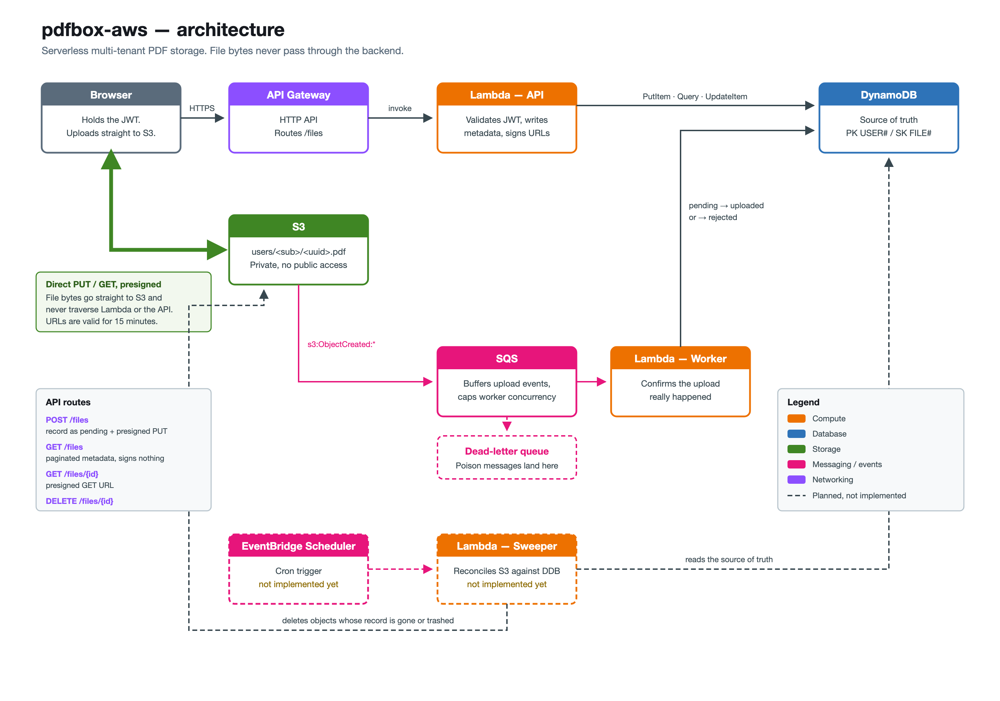

# pdfbox-aws

Serverless multi-tenant PDF storage on AWS, written in Go and provisioned with Terraform, where file bytes never pass through the backend.



## The core idea

The API never touches a single byte of any file. It writes metadata to DynamoDB and hands the browser a short-lived S3 presigned URL; the browser then uploads or downloads directly against S3.

A presigned URL is not an API call. Generating one is a local HMAC-SHA256 computation over the request the client is allowed to make — bucket, key, HTTP method, expiry, and a set of headers — signed with the Lambda's own credentials. No network call to S3 is involved, which is why the operation is effectively free, and also why a URL can be signed for an object that does not exist yet. That last property is what makes the upload flow work: the record is created and the URL is signed before any bytes exist.

The consequence is that Lambda handles kilobytes of JSON regardless of whether the user uploads 12 KB or 50 MB.

## Stack

| Layer | Service |
|---|---|
| Compute | Lambda (Go, `provided.al2023`) |
| HTTP | API Gateway — HTTP API |
| Metadata | DynamoDB |
| Object storage | S3 |
| Eventing | S3 notifications → SQS + DLQ |
| Scheduling | EventBridge Scheduler |
| Observability | CloudWatch Logs |
| Identity | IAM roles, JWT (HS256) |
| Provisioning | Terraform |

## API

All routes require an `Authorization: Bearer <jwt>` header. The token's `user_id` claim becomes the DynamoDB partition key.

| Route | Behaviour |
|---|---|
| `POST /files` | Validates the declared filename, size and MIME type, writes the record as `pending`, returns a presigned `PUT` URL valid for 15 minutes |
| `GET /files` | Cursor-paginated metadata list. Signs no URLs |
| `GET /files/{fileID}` | Returns metadata plus a presigned `GET` URL |
| `DELETE /files/{fileID}` | Moves the record to `deleted` and removes the object from S3 |

`POST /files` accepts `{"filename": "...", "size": 1234, "mime": "application/pdf"}` and returns:

```json
{
  "presigned_url": "https://bucket.s3.region.amazonaws.com/users/...",
  "upload_headers": { "Content-Type": "application/pdf" },
  "file": {
    "id": "0f9c...",
    "filename": "report.pdf",
    "size": 1234,
    "status": "pending",
    "created_at": "2026-08-10T21:14:05Z"
  }
}
```

`upload_headers` must be replayed verbatim on the `PUT`. Those headers take part in the signature, so anything else produces a 403 from S3.

The response deliberately omits the S3 key and the owner ID. The key is an infrastructure detail that would couple clients to the bucket layout, and the owner ID is already carried by the token.

## Upload flow

1. The client calls `POST /files` declaring filename, size and MIME type.
2. The API validates them, generates a UUID, builds the key `users/<user_id>/<uuid>.pdf`, and writes a DynamoDB record with status `pending`.
3. The API signs a `PUT` URL pinned to that key, with `Content-Type` and the exact `Content-Length` included in the signature, and returns it.
4. The browser `PUT`s the bytes straight to S3.
5. S3 emits `s3:ObjectCreated:*` to an SQS queue.
6. The worker Lambda consumes the message, parses the user and file IDs back out of the object key, loads the record, and checks the object's real size against the record and against the 50 MB ceiling.
7. On success the record moves to `uploaded`. On failure it moves to `rejected` and the object is deleted from S3 immediately.

### Why the confirmation event comes from S3, not the client

The obvious alternative is a `POST /files/{id}/confirm` endpoint the client calls after uploading. It does not work, because the client is not a source of truth. It can close the tab mid-upload, lose connectivity, or simply call the confirmation endpoint without ever uploading anything. Only S3 knows whether the object exists, so only S3 gets to say so.

### Why a queue instead of invoking Lambda directly from S3

S3 can invoke a Lambda directly, but the delivery guarantees are weak: a limited number of retries and then the event is gone, with no way to inspect what was lost.

SQS persists the message until it is processed successfully, provides a dead-letter queue for messages that keep failing, and lets the event-source mapping cap the worker's concurrency. That last point matters more than it looks: without a cap, a burst of uploads spawns a burst of worker Lambdas that compete for the account's concurrency limit with the API Lambda, and user-facing requests start getting throttled by a background job.

The worker also reports partial batch failures, so one poisonous message in a batch does not force the redelivery of the messages next to it.

### No dual-write problem

A common shape of this feature has the backend write to a database and then publish an event, which is two writes to two systems with no shared transaction — the problem the outbox pattern exists to solve.

That problem does not arise here. The backend writes only to DynamoDB. The event is published by S3, atomically with the object write, as a property of the object existing. There are never two writes to keep in step, so there is nothing to reconcile between them and no outbox to maintain.

## Trash and reconciliation

`DELETE` is a soft delete on the metadata: the record moves to `deleted` rather than disappearing, which keeps the door open for a restore flow and for a retention window enforced by a DynamoDB TTL.

Deletion is ordered deliberately: mark the record first, delete the object second. The two possible intermediate states are not equally bad. A live object whose record says `deleted` is an invisible orphan costing fractions of a cent. A deleted object whose record says `uploaded` is a broken link the user clicks and a support ticket. Only one of those is acceptable, so the write that closes the user-visible door happens first.

That ordering leaves orphaned bytes behind whenever the second step fails, which is what the reconciliation job exists to clean up. It reads DynamoDB as the source of truth and reconciles S3 against it: deleting objects whose record is gone or trashed, and clearing `pending` records whose upload never arrived.

### Why reconciliation instead of tag-based lifecycle rules

S3 lifecycle rules can expire objects by tag, so an appealing alternative is to tag an object `status=deleted` and let a lifecycle rule remove it a day later.

It does not hold up. Tagging an object is itself an S3 API call, so it fails under exactly the same conditions as the delete it is supposed to compensate for — the same throttling, the same credential expiry, the same network partition. A compensating action that depends on the system that just failed is not a compensation. It has to read from an independent source of truth, which is what a scheduled job reading DynamoDB does.

Lifecycle rules still earn their place for things that need no external knowledge: aborting incomplete multipart uploads, and expiring a staging prefix.

## Design decisions

**Presigned URLs instead of proxying.** Proxying the bytes through Lambda would burn GB-seconds on a function doing nothing but copying a stream, add API Gateway data transfer on top, and cap uploads at Lambda's 6 MB request payload limit — well under the 50 MB the product allows. The presigned URL moves the transfer to a service designed for it and leaves the backend handling metadata.

**Authorization is structural, not procedural.** The JWT's user claim is what builds the DynamoDB partition key. A request for another user's file does not fail an ownership check — it queries a partition the requester does not own and comes back empty. There is no `if file.OwnerID != claims.UserID` to forget, because there is no code path where the wrong user's data is in hand to be checked.

**Server-generated S3 keys.** Keys are `users/<user_id>/<uuid>.pdf`, built server-side from the token claim and a fresh UUID. The client-supplied filename is display metadata that never touches the key. Using it directly would let a client submit `../../users/other/file.pdf` and write outside its own prefix. The prefix then does triple duty: it scopes IAM policies per user, it distributes load across S3 partitions, and it carries the user ID inside the S3 event so the worker can find the record without a lookup table.

The layout is defined once, in `domain.S3KeyFor`, with `domain.ParseS3Key` as its inverse right next to it. Two independent definitions of the same path is how the key and the record drift apart.

**Idempotency, because SQS is at-least-once.** The same upload event can be delivered more than once, so the worker must treat a duplicate as success rather than as an error. Returning an error on a duplicate would send a perfectly healthy message around the retry loop and into the dead-letter queue with nothing actually broken.

**Conditional writes instead of read-then-write.** DynamoDB's `UpdateItem` is an upsert: without a guard, a status update for an unknown ID silently creates a record rather than failing. Every write carries a `ConditionExpression` — `attribute_exists(PK)` on updates, `attribute_not_exists(PK)` on inserts — which also makes the check atomic with the write, leaving no window for a concurrent writer.

**No credentials anywhere.** Nothing in this repository holds an AWS access key. Each Lambda assumes an IAM role and the runtime receives rotating temporary credentials from the environment. The only secret in the system is the JWT signing key.

## Known limitations

- **A presigned URL is a bearer token.** Anyone holding it can use it until it expires, and it is fully self-contained — there is no server-side session to revoke. A 15-minute TTL is the only defence. Handing one out over a channel that logs URLs would leak access to the object.
- **Content type is declared, not verified.** The presigned `PUT` pins `Content-Type` and the exact `Content-Length` inside the signature, so an oversized or mislabelled upload is rejected by S3 before any bytes are stored. But that only enforces what the client *declared*: a ZIP sent as `application/pdf` at the right size still gets through. Real validation means reading the first bytes of the object in the worker and checking for the `%PDF-` magic number, which is not implemented.
- **No CDN.** Every download hits S3 directly. CloudFront with an Origin Access Control belongs in front of the bucket at real volume, both for latency and for egress cost.
- **No multipart upload.** A single `PUT` caps out at 5 GB and cannot retry individual parts, so a failure near the end of a large upload restarts the whole transfer. Irrelevant under a 50 MB limit, and a blocker the moment that limit moves.
- **The frontend polls.** There is no push channel, so a client watching a `pending` file has to poll `GET /files/{id}` until the worker flips it to `uploaded`.
- **Single-region, no replication.** Bucket and table live in one region.

## Not yet implemented

The diagram marks these with dashed borders:

- The reconciliation Lambda and its EventBridge Scheduler rule. The design above describes the intended behaviour; no third binary exists yet.
- The DynamoDB TTL that purges trashed records after a retention window. The `expiresAt` attribute exists on the item but is never written.
- A restore-from-trash route.
- HTTP error mapping. Every handler currently returns `500` on any error, so a missing file surfaces as `500` rather than `404`.

## Running it

Build both Lambda binaries. The `provided.al2023` runtime expects the executable to be called `bootstrap`:

```bash
GOOS=linux GOARCH=arm64 go build -tags lambda.norpc -o build/api/bootstrap ./cmd/api
GOOS=linux GOARCH=arm64 go build -tags lambda.norpc -o build/worker/bootstrap ./cmd/worker
```

Then provision:

```bash
cd infra
cp terraform.tfvars.example terraform.tfvars   # fill in your values
terraform init
terraform plan
terraform apply
```

Tear everything down:

```bash
terraform destroy
```

The bucket must be empty before `destroy` succeeds unless the S3 module sets `force_destroy`.

## Repository layout

```
cmd/
  api/            entrypoint for the HTTP Lambda
  worker/         entrypoint for the SQS consumer Lambda
internal/
  domain/         entities, statuses, errors, S3 key format — no AWS imports
  handler/        use cases, HTTP router, SQS worker, transport DTOs
  adapter/
    auth/         JWT signing and validation
    repository/   DynamoDB access, item mapping, cursor encoding
    storage/      S3 presigning and deletion
docs/             architecture diagram (SVG source + PNG)
infra/            Terraform, one module per AWS service
```

`internal/domain` depends on nothing. The adapters depend on the ports declared alongside the use cases, so swapping DynamoDB or S3 means writing a new adapter rather than touching the business logic.

## Cost

At this volume everything sits inside the AWS free tier, and more importantly nothing runs when idle. There is no NAT Gateway, no RDS instance, no load balancer, and no VPC-attached Lambda — the four line items that usually turn a hobby project into a monthly bill. Lambda, DynamoDB on-demand, SQS and API Gateway all bill per request; S3 bills for the bytes actually stored.

Generating a presigned URL costs nothing at all: it is a local HMAC computation, not an AWS API call.
